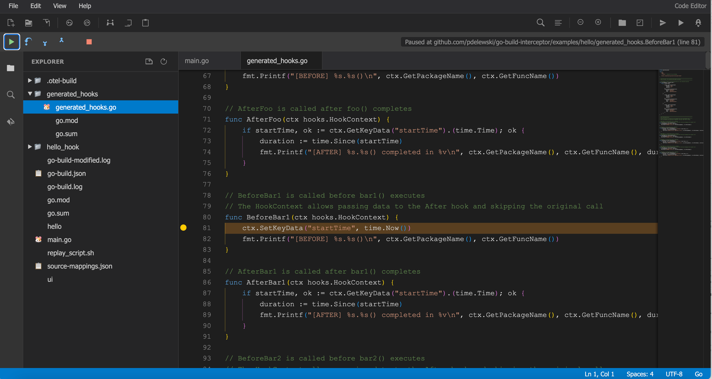

# go-build-interceptor

A Go build instrumentation tool that injects hooks into functions without modifying source files. Add tracing, logging, or metrics to any Go code at build time.

## Installation

```bash
git clone https://github.com/pdelewski/go-build-interceptor
cd go-build-interceptor
go build
```

## Quick Start

### 1. Create a hooks file

```go
package myhooks

import (
    "fmt"
    "time"
    "github.com/pdelewski/go-build-interceptor/hooks"
)

func ProvideHooks() []*hooks.Hook {
    return []*hooks.Hook{
        {
            Target: hooks.InjectTarget{
                Package:  "main",
                Function: "myFunction",
            },
            Hooks: &hooks.InjectFunctions{
                Before: "BeforeMyFunction",
                After:  "AfterMyFunction",
                From:   "myhooks",
            },
        },
    }
}

func BeforeMyFunction(ctx hooks.HookContext) {
    ctx.SetKeyData("startTime", time.Now())
    fmt.Printf("[BEFORE] %s.%s()\n", ctx.GetPackageName(), ctx.GetFuncName())
}

func AfterMyFunction(ctx hooks.HookContext) {
    if startTime, ok := ctx.GetKeyData("startTime").(time.Time); ok {
        fmt.Printf("[AFTER] %s.%s() took %v\n", ctx.GetPackageName(), ctx.GetFuncName(), time.Since(startTime))
    }
}
```

### 2. Compile with hooks

```bash
./go-build-interceptor --compile path/to/myhooks.go
# or short form
./go-build-interceptor -c path/to/myhooks.go
```

This builds your project with the hooks automatically injected.

## Web UI

The included web UI provides an interactive environment for exploring code, generating hooks, and building.



### Setup

```bash
cd ui
make setup    # Install dependencies & build
make run      # Run with default project
```

Or manually:

```bash
cd ui
npm install monaco-editor@0.45.0
cp -r node_modules/monaco-editor/min/vs static/monaco/
go build -o ui .
./ui -dir /path/to/your/project
```

Open http://localhost:9090 in your browser.

### UI Features

- **Code Editor** - Monaco editor with Go syntax highlighting and LSP support
- **Static Call Graph** - View function call relationships
- **Hook Generation** - Select functions and auto-generate hook code
- **Build & Run** - Compile with hooks and run directly from the UI

### Using the UI

1. **View Functions**: Click "Functions" in the View menu to see all functions in your project
2. **Generate Hooks**: Select functions with checkboxes, then click "Generate Hooks"
3. **Compile**: Click Run > Compile, select your hooks file(s), and build
4. **Run**: Click Run > Run Executable to test your instrumented binary

## Command Reference

| Command | Description |
|---------|-------------|
| `--compile <file>` / `-c <file>` | Build with hook instrumentation |
| `--capture` | Capture build commands to go-build.log |
| `--json` | Capture build with JSON output (recommended) |
| `--callgraph` | Show static call graph |
| `--pack-functions` | List all functions |
| `--pack-files` | List compiled files |

## Documentation

- [Hooks Reference](docs/hooks-reference.md) - Complete hook types and API
- [Architecture](docs/architecture.md) - Internal design and components

## Requirements

- Go 1.18+
- Unix-like OS (Linux, macOS)

## License

MIT License