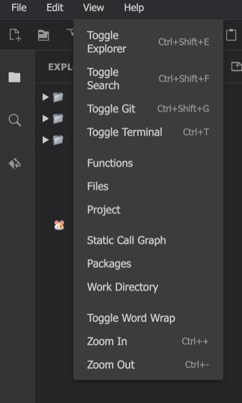
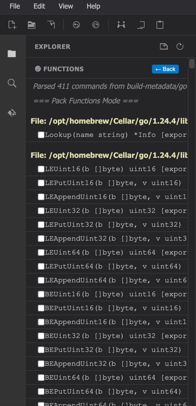
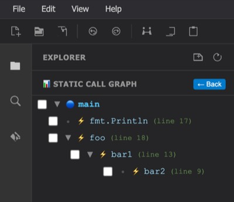
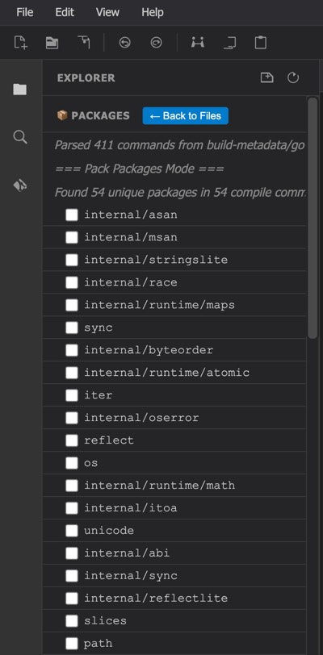
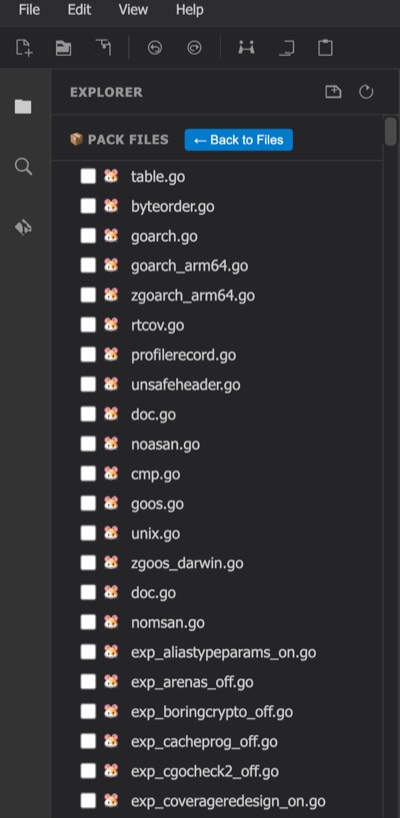
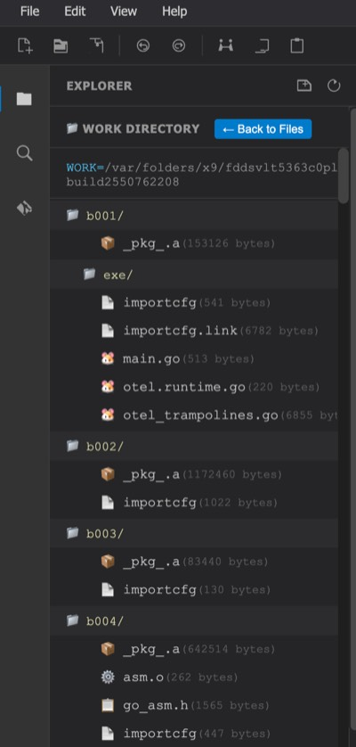
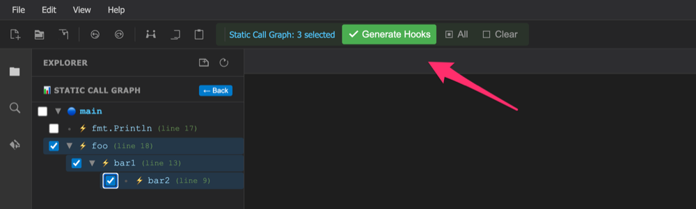
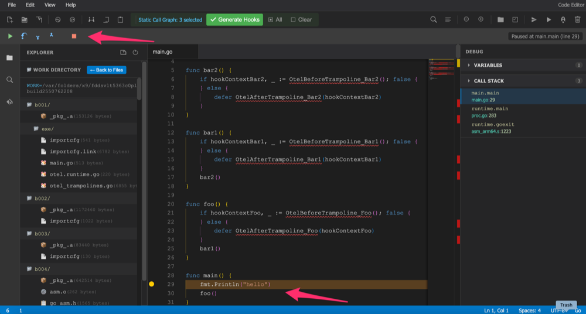

# Context

Whenever we create an abstraction, we should also create tools to manage it.
Abstractions naturally hide some details, and that is fine when everything works correctly, but it may become a problem when a bug occurs. They also conceal internal mechanisms, which means it is harder to understand how something works under the hood. Of course, the people who design these abstractions have this knowledge, but the people who use them usually do not—and then they must struggle with unexpected behavior and differences between the visible model and the actual execution.

That is why it is so important to provide tools that reduce the friction introduced by a new, sophisticated abstraction to the bare minimum and allow users to inspect the hidden details whenever necessary.

# AOP as an Abstraction

AOP is an interesting abstraction. The idea is to inject additional functionality into an existing code base in an orthogonal way—similar to plugging a plugin into the main workflow. Keeping only the primary business logic in the source code and injecting extra aspects on demand during compilation seems like a very good idea from the perspective of comprehension and readability.

There are many cross-cutting concerns—such as logging, tracing, and instrumentation—that look very attractive for AOP techniques. However, these methods may introduce subtle problems that are difficult to notice, debug, and fix without the right tools. At first glance, code readability appears excellent, but the final program often does not resemble what you see in the source code. Therefore, it is crucial to have tools that can display the final effect, help with debugging, and reveal what has actually been produced.

# GoLang Compilation Process

The Go compiler offers several useful switches that allow us to see what it is doing and even intercept the compilation process. A few of them are:

- `-a` : rebuild the whole project
- `-x` : show every compilation step
- `-json` : emit the compilation log as structured JSON
- `-toolexec` : allow the injection of a plugin that acts as an interceptor

These switches make it possible to treat the build process itself as an extensible pipeline.

# go-build-interceptor

## Hook Compiler — practical scenario

go-build-interceptor is a tool composed of two components: the compiler and the UI.
The compiler component injects additional aspects into the user's source code during the Go compilation process. The injection rules are expressed in plain Go in the form of a small internal DSL, which the tool parses from the file provided as an argument.

### Example project

Consider a very simple application in the main package:

```go
package main

import "fmt"

func bar2() {
}

func bar1() {
    bar2()
}

func foo() {
    bar1()
}

func main() {
    fmt.Println("hello")
    foo()
}
```

Suppose you would like to execute some extra logic before and after the foo function, without modifying this original source file. You can create a separate package — for instance generated_hooks — containing the following definitions:

```go
package generated_hooks

import (
    "fmt"
    "time"
    _ "unsafe" // Required for go:linkname

    "github.com/pdelewski/go-build-interceptor/hooks"
)

// ProvideHooks returns the hook definitions for the selected functions.
func ProvideHooks() []*hooks.Hook {
    return []*hooks.Hook{
        {
            Target: hooks.InjectTarget{
                Package:  "main",
                Function: "foo",
                Receiver: "",
            },
            Hooks: &hooks.InjectFunctions{
                Before: "BeforeFoo",
                After:  "AfterFoo",
                From:   "generated_hooks",
            },
        },
    }
}

// BeforeFoo is called before foo() executes.
func BeforeFoo(ctx hooks.HookContext) {
    ctx.SetKeyData("startTime", time.Now())
    fmt.Printf("[BEFORE] %s.%s()\n", ctx.GetPackageName(), ctx.GetFuncName())
}

// AfterFoo is called after foo() completes.
func AfterFoo(ctx hooks.HookContext) {
    if startTime, ok := ctx.GetKeyData("startTime").(time.Time); ok {
        duration := time.Since(startTime)
        fmt.Printf("[AFTER] %s.%s() completed in %v\n",
            ctx.GetPackageName(), ctx.GetFuncName(), duration)
    }
}
```

When such rules are ready, the interceptor compiler can be executed using the main switch --compile (or -c for short):

```bash
go-build-interceptor -c ../../instrumentations/hello/generated_hooks.go
```

The tool parses the DSL code, generates trampoline functions inside the WORK directory, and augments the build plan so that the final program receives the declared aspects. The original code base remains untouched and focused solely on business logic.

### Result

Running the instrumented binary would produce:

```
hello
[BEFORE] main.foo()
[AFTER] main.foo() completed in 27.166µs
```

This practical example shows how AOP-style techniques can stay transparent and readable as long as proper tooling accompanies the abstraction.

### Why Go DSL instead of YAML

Many projects, including the [OpenTelemetry Go compile-time instrumentation effort](https://github.com/open-telemetry/opentelemetry-go-compile-instrumentation), use YAML to express hook rules. YAML is excellent for basic declarative scenarios, but it becomes limiting when more sophisticated rewriting logic is required — for example, changing function signatures, manipulating parameters, or applying context-sensitive transformations.

For that reason, go-build-interceptor relies on plain Go code as its DSL. The guiding principle is simple: if you can express a transformation in Go, you can use it as a rule. YAML can still be layered on top as a convenience format for trivial cases, but internally the Go DSL acts as a powerful and flexible representation.

### OpenTelemetry vs go-build-interceptor — key differences

An alternative approach is used by the OpenTelemetry Go compile-time instrumentation project:

https://github.com/open-telemetry/opentelemetry-go-compile-instrumentation

#### 1) How rules are defined

- OpenTelemetry — YAML-based declarative definitions

- go-build-interceptor — Go-based DSL (with the option to layer YAML on top for simple cases)

Trade-offs:

- YAML is approachable and easy to audit, but it becomes limiting with complex rewrites.

- Go DSL offers full language power and enables context-sensitive transformations, though it expects users to be comfortable with a more programmatic style.

#### 2) How injection is performed

- OpenTelemetry uses -toolexec, wrapping compiler tool invocations during the build.

- go-build-interceptor uses build-log dump + modify + replay via -x -json -a.

The log+replay direction was explored because it is easier to reason about and, importantly, easier to debug the tool itself. A -toolexec plugin is powerful, but debugging the plugin can be difficult because it runs inside the build pipeline. The modified build plan becomes explicit and replayable, which greatly helps when developing and validating such tooling.

## UI

The second component of go-build-interceptor is the UI, whose main goal is to reduce the friction related to AOP techniques. It offers a View menu—a window through which you can examine your project from different perspectives.

<table>
<tr>
<td align="center" valign="top"><br><b>View Menu</b></td>
<td align="center" valign="top"><br><b>Functions</b></td>
<td align="center" valign="top"><br><b>Call Graph</b></td>
<td align="center" valign="top"><br><b>Packages</b></td>
<td align="center" valign="top"><br><b>Files</b></td>
<td align="center" valign="top"><br><b>WORK Dir</b></td>
</tr>
</table>

The UI allows users to:

- generate hook boilerplate automatically using a dedicated button,



- explore the project from a static call-graph view,
- browse functions detected in the source code,
- inspect files and packages involved in the compilation process.

You can also examine the WORK directory, which is a temporary directory created by the Go compiler to build the project. All intermediate files are stored there, so you can check exactly how files modified or added by the interceptor look in their final form.

Last but not least, the UI offers debugging capabilities, where you can go through the final code step by step, set breakpoints, and verify that everything behaves as expected.



The UI is independent from the compilation component, so potentially it could be reused by the OpenTelemetry project or integrated with existing IDEs in the future.

# Conclusions

This project is still in the alpha stage and has several limitations: missing functionality, shortcuts, and bugs. However, the main goal was to explore new directions, bring these techniques closer to users, and provide something that could be used daily as a practical development tool.

Potentially, the UI could become a plugin (or a set of plugins) for already existing IDEs, but the objective was to build a tool that is independent, standalone, and usable without heavy external dependencies.

---

*[go-build-interceptor](https://github.com/pdelewski/go-build-interceptor) is open source under the Apache License 2.0. Contributions and feedback are welcome.*
